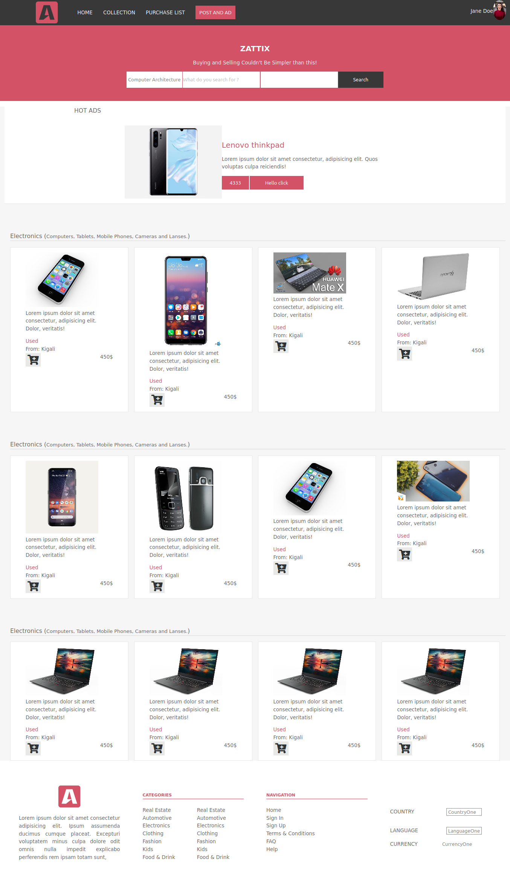
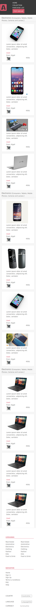
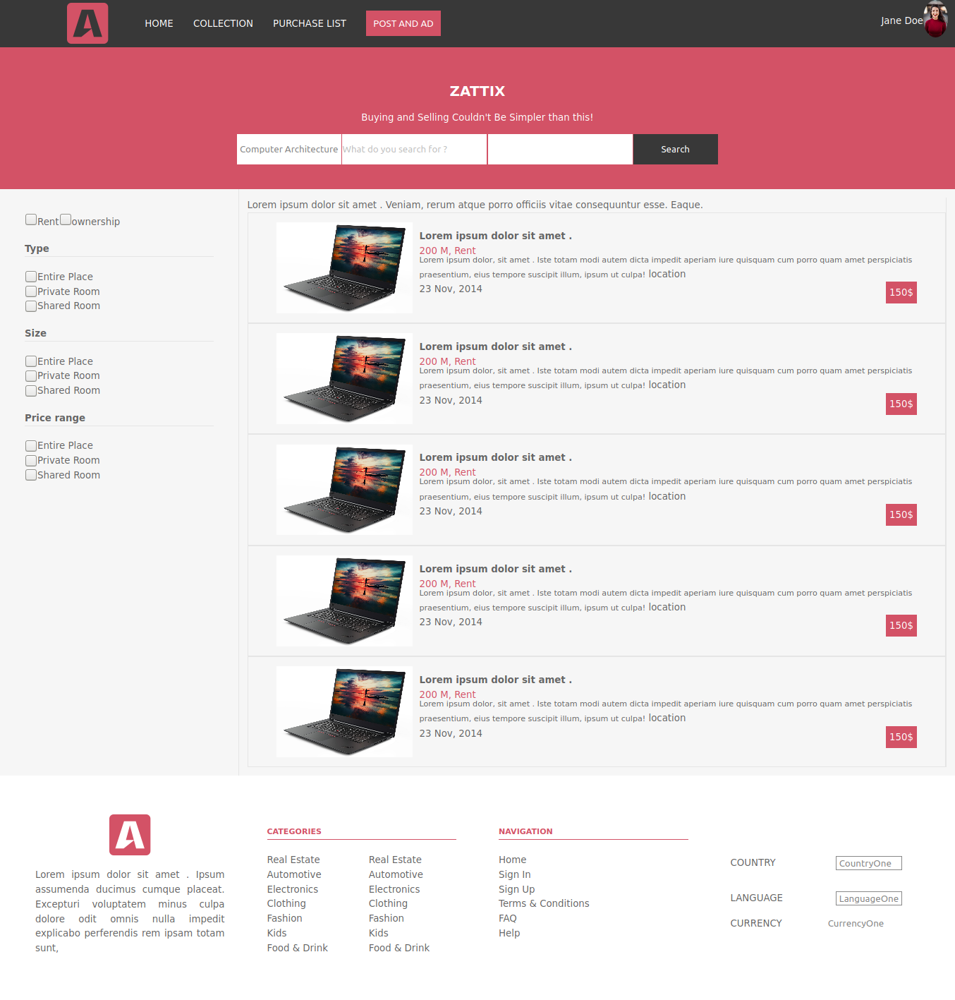
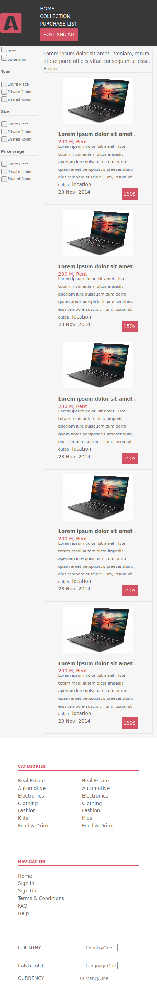
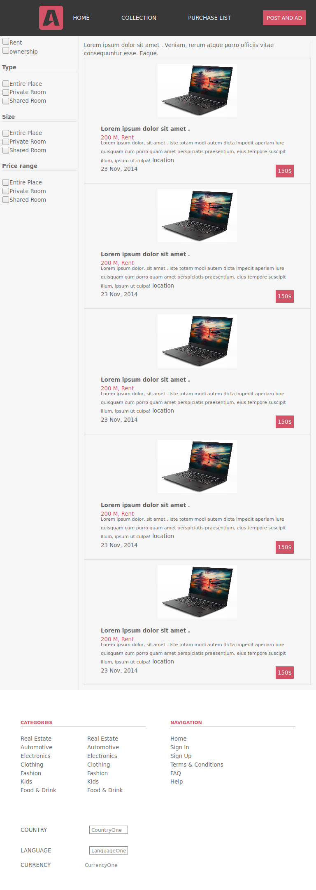

# Online Shop

> This project is from [Microverse](https://www.microverse.org/) main curriculum, the Capstone [click here](https://www.notion.so/HTML-CSS-capstone-project-Online-shop-for-electronics-a3dbffab0c744c33b70001a79876edde).

## Screenshots

### Home page

#### Laptop and Desktops screen
;

#### Mobile screens
;

#### Tablets screens
;

### Chat page

#### Laptop and Desktops screen
;

#### Mobile screens
;

#### Tablets screens
;

## Built With

- [HTML](https://developer.mozilla.org/en-US/docs/Web/HTML),
- [CSS](https://www.w3schools.com/css/).

## Tools used

- [Fontawesome](https://fontawesome.com/),
- [Node](https://nodejs.org/en/),
- [stickler](https://stickler-ci.com/),
- [HTML validator](https://validator.w3.org/),
- [Git](https://git-scm.com/).

## Live Demo

[Live Demo Link](https://muhenge.github.io/capstone/)

## Getting Started

-Use `git clone https://github.com/muhenge/capstone.git` 

### Setup
Use `npm install` to set up and install all packages(fontawesome) locally

## Authors

👤 **Author**

- Github: [Herve](https://github.com/muhenge)

## 🤝 Contributing

Contributions, issues and feature requests are welcome!

Feel free to check the [issues page](https://github.com/muhenge/capstone/issues).

Feel free to clone
